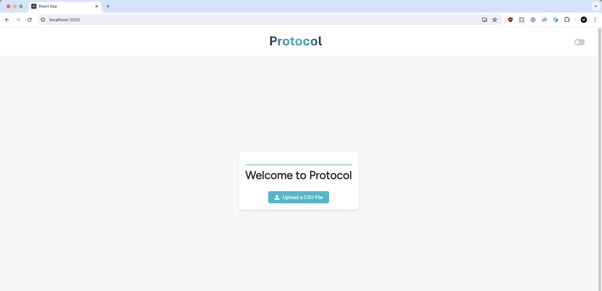
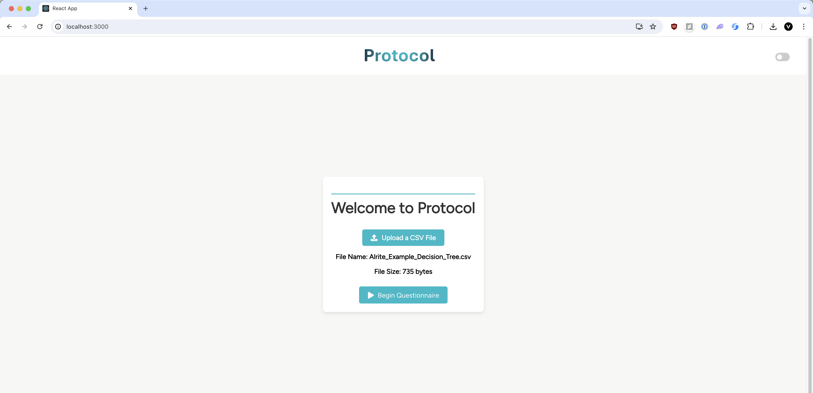
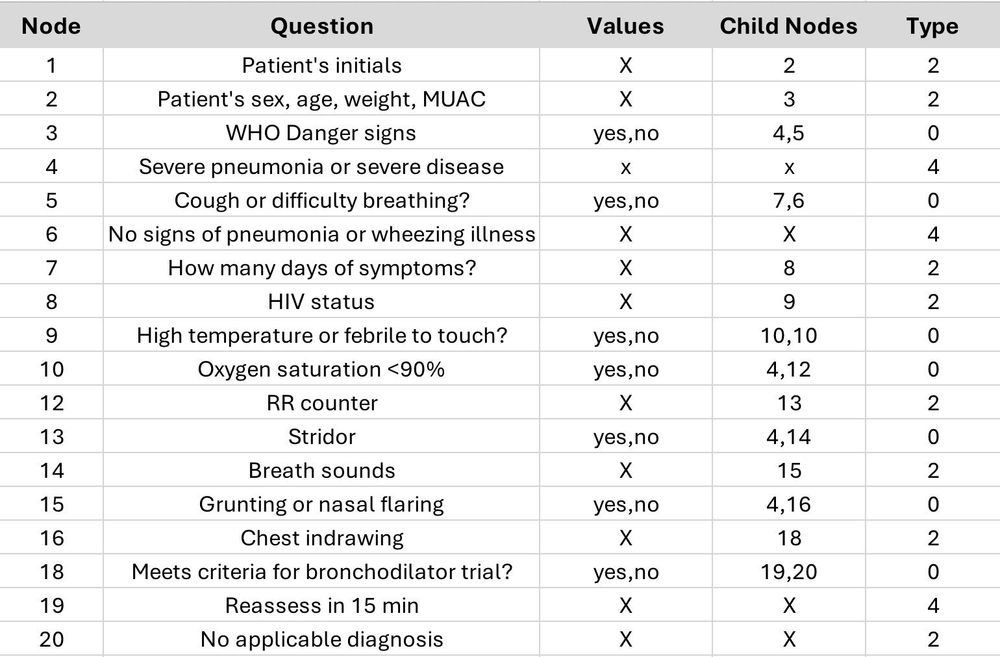
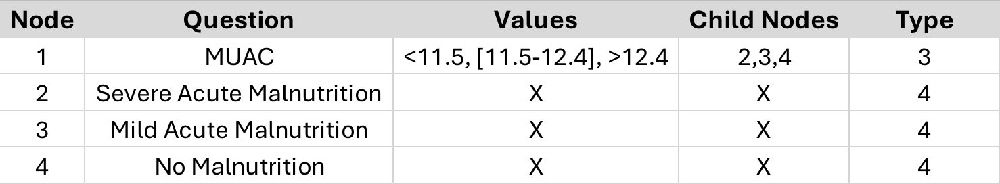

# Protocol App

## Launching the web app:

After cloning the repository, navigate to the backend_parser folder from the main project directory:

### `cd backend_parser`

Then run:

### `Python Parsing.py`

This starts the backend Python script. Note: we recommend running Procotol using Python 3.9. To launch the frontend web app, open a new terminal and run:

### `npm start`

Open [http://localhost:3000](http://localhost:3000) to view Protocol in your browser.

## Uploading a Decision Tree CSV:

Once the Protocol app has been launched, you can upload a decision tree in the form of a CSV file. Two example CSVs are provided in the repository for your reference: 
* Alrite_Example_Decision_Tree.csv 
* MUAC_Example_Decision_Tree.csv 

You may upload one of these CSVs that are already correctly formatted, or create your own.

## Decision Tree Schema:

If you'd like to create your own decision tree, you must follow a specific schema for the CSV file. We recommend first creating the file in Microsoft Excel, and the exporting to CSV format after.

Our schema (column headers) for the Excel file is as follows: 'Node, Question, Values, Child Nodes, Type'. This is also shown in the table above. Each node (which is a question/diagnosis, or a page in the questionnaire) possesses all 5 pieces of information that make up a page in our questionnaire. First, the 'Node' field is a number that is just a unique identifier for that node. The 'Question' field is the question (or diagnosis) that will display on the page for that node. The 'Values' field is the different answers for the question that result in branches that will lead to other nodes. This field is very important and corresponds in respective order to the 'Child Nodes' field, which specifies which child node each answer maps to. For example, if we have the field 'Values' as 'yes, no', and 'Child Nodes' as '4,5', this means the answer 'yes' corresponds to Node 4 and the answer 'no' corresponds to Node 5. Finally, we have our 'Type' field, which is how allow the user to specify what type of question they would like. 

| Type | Definition          |
|------|----------------------|
| 0    | Yes / No Buttons     |
| 1    | Dropdown             |
| 2    | Text Input           |
| 3    | Numeric Input        |
| 4    | Diagnosis Screen     |

As shown in table above, we have 5 different types of nodes. Type 0 is a `yes/no' button, which is just 2 buttons that allow you to select yes or no. Type 1 is a dropdown, which allows you to select a choice from a given list of choices in a dropdown format. Type 2 is text input, which allows you to input any text you would like into a text box. Type 3 is numeric input, which allows you to specify number ranges for the answer to be in. For example, in the table below, we can see the ranges in the 'Values' field of '<11.5,[11.5-12.4], >12.4'. This means if any value less than 11.5 is put in, the application will go to Node 2, any value between 11.5 and 12.4 INCLUSIVE goes to Node 3, and any value greater than 12.4 goes to Node 4.

## Acknowledgements:

This project was bootstrapped with [Create React App](https://github.com/facebook/create-react-app).
